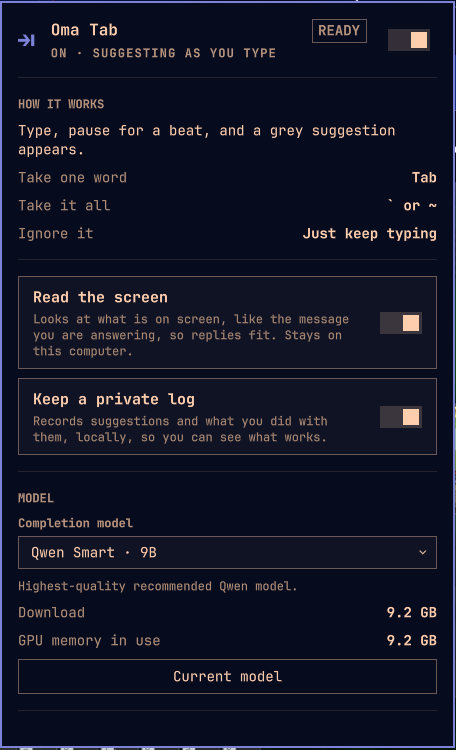

# Oma Tab for Omarchy



The bar widget for [Oma Tab](https://github.com/r3dbars/tilde-linux): private,
local AI autocomplete for everything you type. Type, pause, and a grey
suggestion appears. `Tab` takes a word; `Shift+Tab` takes it all. Nothing you
type leaves your computer.

The widget is a `⇥` in the bar. Click it for the panel, right-click to pause
or resume suggestions.

The panel:

- Installs Oma Tab itself if it is missing, in a terminal you can watch, and
  shows setup progress while it runs.
- One switch for suggestions, one for reading the screen, one for the
  private local log.
- Shows which keys take a word and take everything.
- A model picker sized to your GPU, with an explicit download step.
- How fast suggestions appear, how many were shown, how many you took.
- Try-it demo, update, and restart.

## Install

```bash
omarchy plugin add https://github.com/r3dbars/omarchy-omatab.git --enable
```

Then click the `⇥` in the bar and press **Install Oma Tab**. That runs
`install.sh` in a floating terminal. It:

- clones Oma Tab into `~/.local/src/omatab` and runs its bootstrap;
- asks for your password once, to install packages with `pacman` and to
  enable the Ollama service;
- builds Oma Tab and installs it under `~/.local`;
- adds Oma Tab to your Fcitx input-method group and makes it the default,
  and installs a user D-Bus service file that routes Fcitx activation to
  Omarchy's Fcitx unit;
- downloads a model sized to your GPU (2 to 4 GB).

Adding or enabling the plugin never runs any of that. Setup only starts when
you press the button, or run `~/.config/omarchy/plugins/r3dbars.omatab/install.sh`
yourself.

## Update

```bash
omarchy plugin update r3dbars.omatab   # the widget
```

Press **Update Oma Tab** in the panel, or run `omatab update`, for Oma Tab
itself.

## Remove

```bash
omatab uninstall            # Oma Tab; add --purge to delete settings and the log
omarchy plugin remove r3dbars.omatab
```

`omatab uninstall` removes the Fcitx addon, the CLI, the model-warming
timer, and the D-Bus service file. Downloaded models stay in Ollama; remove
them with `ollama rm`.

## Dependencies

Installed by setup, from the Arch repositories: `fcitx5`, `cmake`, `ninja`,
`gcc`, `pkgconf`, `jsoncpp`, `curl`, `jq`, `tesseract`,
`tesseract-data-eng`, `grim`, and `ollama-cuda`, `ollama-rocm`, or `ollama`
depending on the GPU. Everything runs locally.

The widget itself only calls `~/.local/bin/omatab`, `xdg-open`, and
Omarchy's floating-terminal launcher.

## Development

```bash
node --test tests/
omarchy plugin validate .
```

The shell reloads saved plugin files automatically.

## License

MIT. Oma Tab itself is also MIT.
